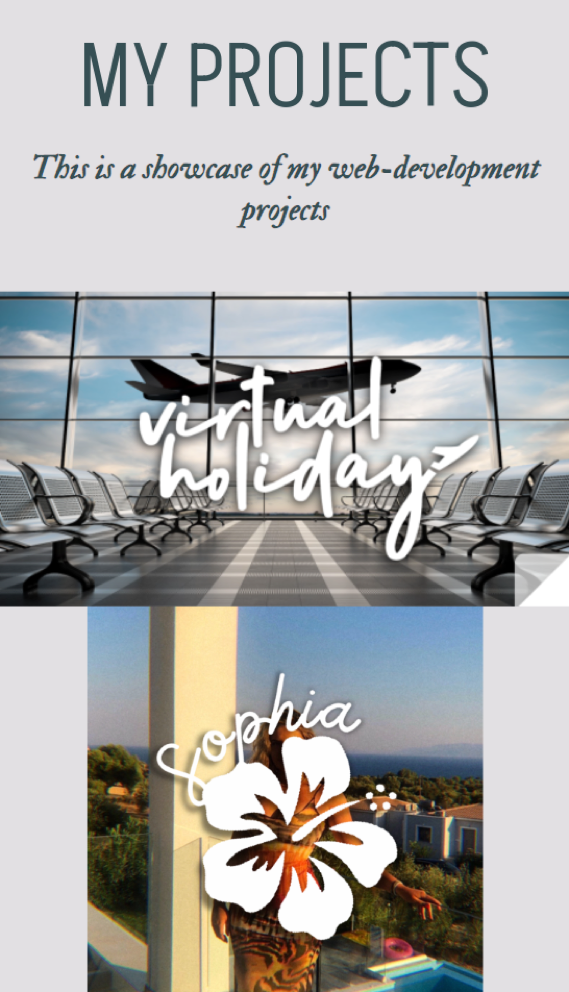

# Sophia's Portfolio

Hello! My name is Sophia.

Please click the link below to view my personal portfolio: https://sophia4422.github.io/my-portfolio/

# Styling

I love the beach and I wanted my portfolio to reflect that. I chose sea-foam, neutral colours and added a picture of myself in Kefalonia, Greece (in the distance you can see an island, that is Zante). My logo is of a tropical hibiscus flower. The serif font I chose kind of reminds me of pirate handwriting(?) and the sans-serif font compliments this nicely. The curved svg has been added to resemble waves.

# Development Over Time

This portfolio was first made on my second week of the University of Birmingham's Coding Bootcamp. It has been so rewarding to come back to this portfolio and update it. I have now completed 9 weeks of coding, 6 challenges and my first group project.

I remember the first time I made this portfolio, I was having a lot of trouble making it look correct in mobile viewports. Now, I have been able to fix these errors in such a short space of time. Little things like this stand out to me, as it shows my development and how far I have come with my web-development learning.

# Screenshot of my Webpage in Browser

When you hover over the project icons, a title and description appears:

The contact me section uses hyperlinked icons to take the guest to my github or linked in. The paper icon links to my CV.

# Screenshot of my Webpage in Mobile

P.S. My cat's name is Cookie :)

# Thanks for reading!
